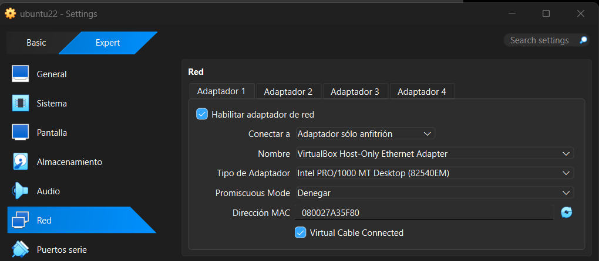

# Laboratorio de Detección con Wazuh SIEM/XDR: Reconocimiento de Red y Detección de Fuerza Bruta RDP

## 📌 Resumen Ejecutivo
Este proyecto documenta el despliegue, configuración y uso operacional de **Wazuh SIEM/XDR** en un entorno de laboratorio virtualizado. El laboratorio simula flujos de trabajo reales de un Centro de Operaciones de Seguridad (SOC), incluyendo la ingestión de telemetría de endpoints, caza de amenazas (*threat hunting*), análisis de reconocimiento de red y detección en tiempo real de ataques de fuerza bruta contra endpoints Windows.

---

## 🛠️ Arquitectura y Topología del Laboratorio

El laboratorio está aislado dentro de una red virtual dedicada en modo Adaptador Solo-Anfitrión (*Host-Only* `192.168.56.0/24`), garantizando cero riesgo para infraestructuras externas.

| Rol del Nodo | Sistema Operativo / Plataforma | Dirección IP | Nombre de Host / Detalles |
| :--- | :--- | :--- | :--- |
| **Servidor SIEM** | Ubuntu Server 22.04 LTS | `192.168.56.103` | Wazuh Manager v4.8.2 + Dashboard |
| **Endpoint Monitoreado** | Windows 10 Pro | `192.168.56.105` | Agente Wazuh (ID: `003`) |
| **Atacante (Threat Actor)** | Kali Linux | `192.168.56.101` | Plataforma de Reconocimiento y Ataque |

---

## ⚙️ Fase 1: Configuración de Infraestructura y Red

Todas las máquinas virtuales se configuraron en VirtualBox bajo el adaptador **Solo-Anfitrión** (`VirtualBox Host-Only Ethernet Adapter`) para permitir la comunicación local manteniendo el tráfico aislado.

### Configuración de Adaptadores en VirtualBox
* **Configuración de Red en Servidor Ubuntu (SIEM):**
  

* **Configuración de Red en Kali Linux (Atacante):**
  

* **Configuración de Red en Windows 10 (Víctima):**
  

### Verificación de Conectividad y Gestión SSH
Se comprobó la conectividad bidireccional mediante solicitudes ICMP entre los nodos.
* **Prueba de Ping (Kali a Windows 10):**
  

* **Administración Remota (SSH hacia Wazuh Manager):**
  Sesión SSH segura establecida hacia el servidor Ubuntu para administración remota.
  

---

## 🛡️ Fase 2: Despliegue del Agente e Ingestión de Telemetría

Se instaló el Agente de Wazuh v4.8.2 en la máquina objetivo (`ESCRITORIO-FVQ726N`). La comunicación cifrada con el Manager se estableció a través de los puertos TCP `1514/1515`.

* **Verificación del Agente en el Dashboard de Wazuh:**
  El agente se registró exitosamente mostrando un estado **Activo** bajo el nodo `node01`.
  

---

## ⚔️ Fase 3: Simulación de Ataques y Análisis SOC

### 1. Reconocimiento de Red y Enumeración de Servicios (Nmap)
Se ejecutó un escaneo dirigido con Nmap desde Kali Linux para inspeccionar puertos abiertos y capacidades de cifrado RDP en la IP `192.168.56.105`.

`nmap -p 3389,445 --script rdp-enum-encryption,smb-enum-shares 192.168.56.105`

* **Resultados:** Se identificó el puerto `3389/tcp` (RDP) como abierto y respondiendo con soporte CredSSP/NLA. El puerto `445/tcp` (SMB) figuraba como filtrado.


> **Nota SOC:** Los escaneos pasivos de servicios no generan alertas de autenticación en Windows por defecto, a menos que se habilite explícitamente la auditoría en el firewall local o se integre un IDS de red (como Suricata).

---

### 2. Ataque Automatizado de Fuerza Bruta RDP (Hydra)
Se lanzó un ataque de diccionario dirigido al servicio RDP utilizando Hydra para forzar la generación de eventos de fallo de autenticación en el Visor de Eventos de Windows.

`hydra -l usuario_prueba -P /usr/share/wordlists/rockyou.txt rdp://192.168.56.105 -t 4`


---

## 🚨 Fase 4: Detección en el SIEM y Triaje de Incidentes

Durante la ejecución de Hydra, el servidor Wazuh procesó la telemetría del registro de seguridad de Windows (**Event ID 4625** - *Fallo de inicio de sesión*), correlacionando en tiempo real las fallas de autenticación repetidas.

* **Panel de Caza de Amenazas en Wazuh:**
  Se capturó un pico masivo (+700 eventos) en el histograma de alertas.
  

### Reglas de Correlación Disparadas
1. **Regla 60122 (Nivel 5):** `Fallo de inicio de sesión - Usuario desconocido o contraseña incorrecta.`
2. **Regla 60204 (Nivel 10):** `Múltiples fallos de inicio de sesión de Windows.` (Disparada al superar el umbral de intentos fallidos en cuestión de segundos).

---

## 📄 Reporte de Incidente (Ejemplo de Ticket SOC L1)

```text
================================================================================
REPORTE DE TICKET DE INCIDENTE SOC
================================================================================
ID DE TICKET     : INC-2026-0811-001
SEVERIDAD        : ALTA (Alerta Nivel 10)
CATEGORÍA        : Intento de Acceso No Autorizado / Fuerza Bruta
ESTADO           : Abierto / En Investigación

ACTIVO AFECTADO
Nombre de Host   : ESCRITORIO-FVQ726N
Dirección IP     : 192.168.56.105
ID de Agente     : 003

HALLAZGOS DETALLADOS
Se detectó un alto volumen de intentos fallidos de inicio de sesión vía RDP 
(Puerto 3389) en una ventana temporal reducida (~113 intentos/min). Wazuh 
correlacionó la regla 60122 y activó la regla de umbral 60204 
(Nivel 10 - Múltiples fallos de inicio de sesión en Windows).

REMEDIACIÓN RECOMENDADA
1. Inmediata   : Bloquear la IP origen mediante Respuesta Activa / Firewall local.
2. Corto Plazo : Forzar la autenticación a nivel de red (NLA) y políticas de bloqueo de cuenta.
3. Largo Plazo : Restringir la exposición directa de RDP detrás de una VPN con MFA.
================================================================================

🔑 Conclusiones Clave
Se validó el flujo completo de ingesta de logs desde endpoints Windows hacia el servidor Wazuh.

Se diferenció técnicamente entre el escaneo a nivel de red (invisible para el SIEM del host sin IDS) y los ataques a nivel de aplicación/autenticación.

Se documentó un flujo de trabajo estandarizado para el triaje y reporte de incidentes en un SOC Nivel 1.
